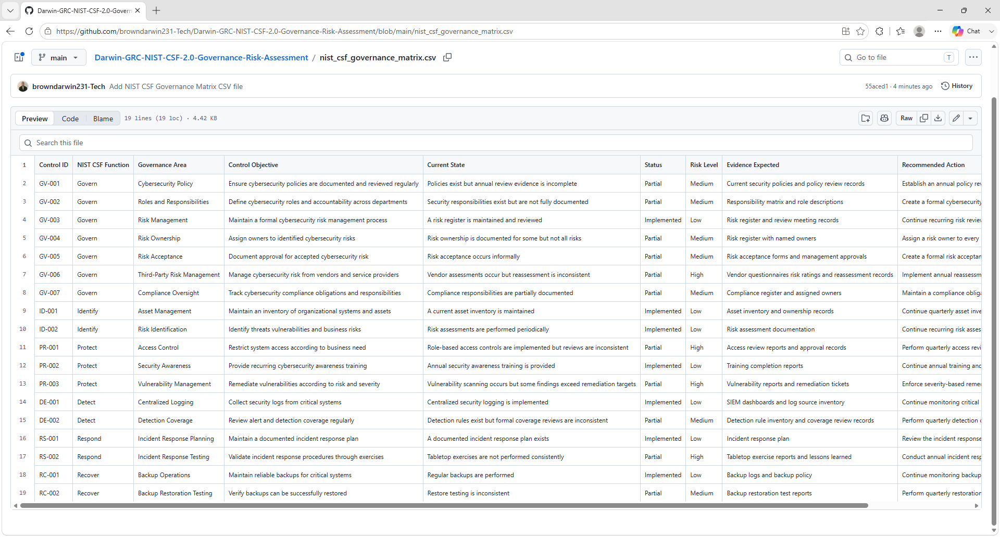
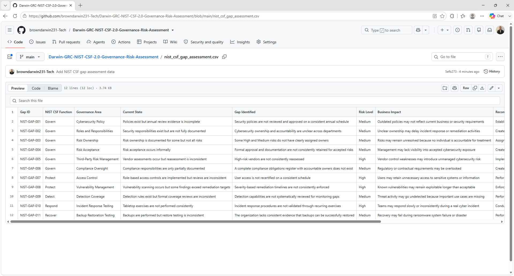
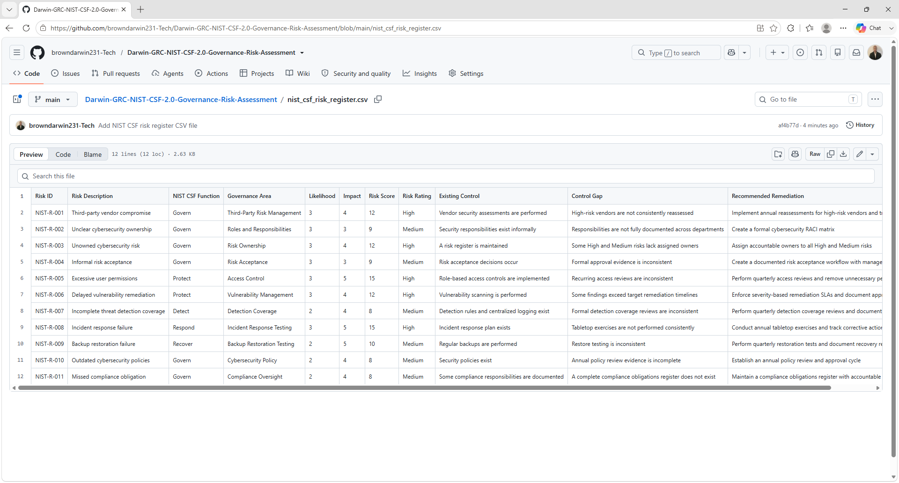

# Darwin-GRC-NIST-CSF-2.0-Governance-Risk-Assessment

Hands-on GRC project simulating a NIST CSF 2.0 governance and cybersecurity risk assessment, control mapping, gap analysis, and remediation planning.

## Project Overview

This project simulates a NIST Cybersecurity Framework 2.0 governance and risk assessment for a fictional SaaS organization called **CloudNova Technologies**.

The goal is to evaluate cybersecurity governance, identify security risks, map controls to NIST CSF 2.0 functions, document gaps, and develop remediation recommendations.

This project demonstrates practical GRC skills including:

- NIST CSF 2.0
- Cybersecurity governance
- Risk assessment
- Control mapping
- Gap analysis
- Risk registers
- Policy and governance review
- Remediation planning
- Security documentation
- Audit readiness

## Business Scenario

CloudNova Technologies is a fictional SaaS company with approximately 75 employees.

The organization uses:

- Microsoft 365
- Microsoft Azure
- Cloud-based applications
- Multi-Factor Authentication
- Endpoint security
- Centralized logging
- Third-party vendors
- Security awareness training
- Backup and recovery systems

The organization wants to evaluate its cybersecurity program against the NIST CSF 2.0 functions:

- Govern
- Identify
- Protect
- Detect
- Respond
- Recover

## Assessment Scope

The assessment focuses on:

- Cybersecurity governance
- Roles and responsibilities
- Risk management
- Third-party risk
- Asset management
- Access control
- Security awareness
- Vulnerability management
- Logging and monitoring
- Incident response
- Business continuity
- Recovery planning

## NIST CSF 2.0 Functions

### Govern

Establishes cybersecurity strategy, policies, responsibilities, oversight, and risk management expectations.

### Identify

Identifies assets, systems, business processes, threats, vulnerabilities, and risks.

### Protect

Implements safeguards to reduce cybersecurity risk.

### Detect

Identifies potential cybersecurity events through monitoring and detection capabilities.

### Respond

Supports containment, communication, investigation, and response to cybersecurity incidents.

### Recover

Supports restoration of systems and business operations after a cybersecurity incident.

## Governance Review

The governance assessment evaluates areas including:

- Cybersecurity policies
- Security roles and responsibilities
- Risk ownership
- Risk acceptance
- Third-party oversight
- Security performance reporting
- Compliance responsibilities
- Management review

## Key Findings

| Area | NIST CSF Function | Status | Risk |
|---|---|---|---|
| Cybersecurity Policy Review | Govern | Partial | Medium |
| Security Roles and Responsibilities | Govern | Partial | Medium |
| Risk Register Management | Govern / Identify | Implemented | Low |
| Third-Party Risk Management | Govern | Partial | High |
| Asset Inventory | Identify | Implemented | Low |
| Access Reviews | Protect | Partial | High |
| Security Awareness | Protect | Implemented | Low |
| Vulnerability Remediation | Protect | Partial | High |
| Centralized Logging | Detect | Implemented | Low |
| Detection Coverage Review | Detect | Partial | Medium |
| Incident Response Testing | Respond | Partial | High |
| Backup Restoration Testing | Recover | Partial | Medium |

## Risk Assessment Method

Risk is calculated using:

Risk Score = Likelihood × Impact

### Likelihood

- 1 = Rare
- 2 = Unlikely
- 3 = Possible
- 4 = Likely
- 5 = Almost Certain

### Impact

- 1 = Insignificant
- 2 = Minor
- 3 = Moderate
- 4 = Major
- 5 = Severe

### Risk Ratings

- 1–4 = Low
- 5–10 = Medium
- 11–15 = High
- 16–25 = Critical

## Example Risks

| Risk | Likelihood | Impact | Score | Rating |
|---|---:|---:|---:|---|
| Third-party vendor compromise | 3 | 4 | 12 | High |
| Excessive user permissions | 3 | 5 | 15 | High |
| Delayed vulnerability remediation | 3 | 4 | 12 | High |
| Incident response failure | 3 | 5 | 15 | High |
| Incomplete detection coverage | 2 | 4 | 8 | Medium |
| Backup restoration failure | 2 | 5 | 10 | Medium |

## Governance Findings

### Finding 1: Security Roles and Responsibilities

**Current State:**  
Security responsibilities exist but are not fully documented across departments.

**Risk:**  
Ownership and accountability may be unclear during security incidents or compliance activities.

**Risk Level:**  
Medium

**Recommendation:**  
Create a documented cybersecurity responsibility matrix showing owners for risk management, incident response, vendor risk, access control, and security monitoring.

### Finding 2: Third-Party Risk Governance

**Current State:**  
Vendor assessments occur, but recurring reassessment and formal risk ownership are inconsistent.

**Risk:**  
High-risk vendors may introduce cybersecurity risk without appropriate oversight.

**Risk Level:**  
High

**Recommendation:**  
Establish formal vendor risk classification, recurring reassessments, risk ownership, remediation tracking, and approval requirements.

### Finding 3: Incident Response Governance

**Current State:**  
An incident response plan exists, but testing is inconsistent.

**Risk:**  
Roles, escalation paths, and communication procedures may not work as expected during a real incident.

**Risk Level:**  
High

**Recommendation:**  
Conduct annual tabletop exercises and document participants, decisions, lessons learned, and corrective actions.

## Remediation Priorities

1. Formalize third-party risk governance
2. Improve cybersecurity role ownership
3. Conduct recurring access reviews
4. Enforce vulnerability remediation timelines
5. Conduct annual incident response tabletop exercises
6. Review detection coverage regularly
7. Perform quarterly backup restoration testing
8. Review cybersecurity policies annually

## Repository Structure

Darwin-GRC-NIST-CSF-2.0-Governance-Risk-Assessment/
│
├── README.md
├── nist_csf_governance_matrix.csv
├── nist_csf_gap_assessment.csv
├── nist_csf_risk_register.csv
├── governance_findings.md
├── remediation_plan.md
└── evidence/

## Evidence Screenshots

### NIST CSF 2.0 Governance Matrix

### NIST CSF 2.0 Gap Assessment

### NIST CSF 2.0 Risk Register

## Skills Demonstrated

- NIST CSF 2.0
- Governance, Risk, and Compliance
- Cybersecurity Governance
- Risk Assessment
- Risk Registers
- Control Mapping
- Gap Analysis
- Third-Party Risk Management
- Policy Review
- Incident Response Governance
- Security Monitoring
- Remediation Planning
- Compliance Documentation

## Project Goal

The goal of this project is to demonstrate practical NIST CSF 2.0 governance and risk assessment skills by evaluating cybersecurity governance, identifying risks, mapping controls, documenting gaps, and developing remediation recommendations.
